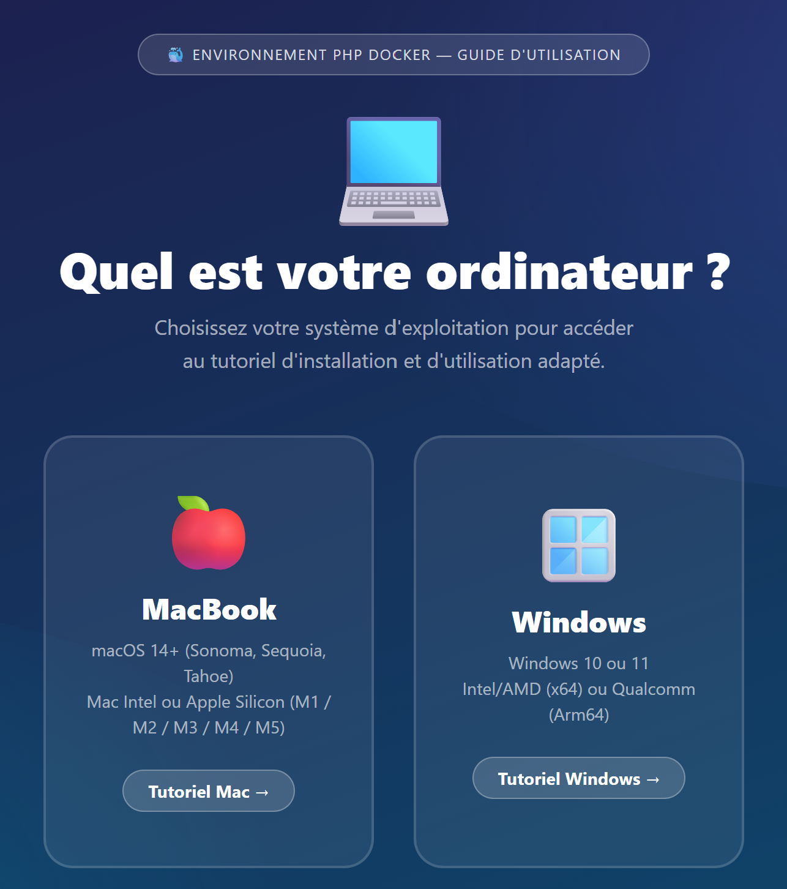

<p align="center">
  
</p>

<h1 align="center">Environnement PHP Docker</h1>

<p align="center">
  <strong>Equivalent de XAMPP — clé en main, zéro configuration.</strong><br>
  Apache 2.4 · PHP 7.4 · MariaDB 10.6 · phpMyAdmin · Portainer
</p>

<p align="center">
  
  
  
  
  
</p>

---

## Installation — 3 étapes

### 1. Installer Docker Desktop (une seule fois)

Téléchargez et installez [Docker Desktop](https://www.docker.com/products/docker-desktop) pour votre système.

> **Windows** : Docker Desktop installe automatiquement tout ce dont il a besoin (y compris WSL2). Redémarrez si demandé.

### 2. Télécharger ce projet

**Option A — Sans Git (débutants)**

1. Sur cette page, cliquez sur le bouton vert **`<> Code`** (en haut à droite)
2. Cliquez sur **`Download ZIP`**
3. Ouvrez le fichier ZIP téléchargé
4. **Extrayez** (décompressez) le dossier sur votre **Bureau**
5. Nommez le dossier **`PHPenv`**

**Option B — Avec Git**

```bash
cd ~/Desktop
git clone https://github.com/selinachegg/php-docker-environment.git PHPenv
```

### 3. Lancer

**Launcher (recommandé)** — Un menu interactif pour tout gérer :

| Système | Commande |
|---------|----------|
| **Windows** | Double-cliquez sur `launcher.bat` |
| **macOS** | Double-cliquez sur `launcher.command` |

> **macOS — première fois uniquement** : ouvrez Terminal et tapez `chmod +x launcher.command start.command stop.command`

Le launcher vous permet de **démarrer**, **arrêter**, **redémarrer** l'environnement et **réinitialiser Portainer** depuis un seul menu.

Les scripts individuels (`start.bat`, `stop.bat`, `start.command`, `stop.command`) restent disponibles pour un usage manuel.

Le premier lancement prend **5 à 10 minutes** (téléchargement des images). Les suivants : **~10 secondes**.

---

## Vos services

| Service | Adresse | Description |
|---------|---------|-------------|
| 🌐 **Site PHP** | [localhost:8080](http://localhost:8080) | Vos fichiers PHP (dossier `htdocs/`) |
| 🗄️ **phpMyAdmin** | [localhost:8081](http://localhost:8081) | Gestion visuelle de la base de données |
| 🐳 **Portainer** | [localhost:9000](http://localhost:9000) | Gestion visuelle des conteneurs Docker |
| 🏠 **Tableau de bord** | [localhost:8082](http://localhost:8082) | Page d'accueil avec tous les liens |

---

## Travailler avec PHP

Vos fichiers PHP vont dans le dossier **`htdocs/`**. Les modifications sont **instantanées** — pas besoin de redémarrer.

```php
<?php
// htdocs/bonjour.php → http://localhost:8080/bonjour.php
echo "Bonjour le monde !";
?>
```

### Connexion à la base de données

```php
<?php
$pdo = new PDO(
    "mysql:host=db;dbname=app;charset=utf8mb4",
    "app",   // utilisateur
    "app"    // mot de passe
);
?>
```

| Paramètre | Valeur |
|-----------|--------|
| Hôte | `db` |
| Base de données | `app` |
| Utilisateur | `app` |
| Mot de passe | `app` |
| Mot de passe root | `root` |

---

## Arrêter l'environnement

Utilisez le **launcher** ou les scripts individuels :

| Système | Commande |
|---------|----------|
| **Windows** | Double-cliquez sur `stop.bat` |
| **macOS** | Double-cliquez sur `stop.command` |

> Vos fichiers PHP et vos données de base de données sont conservés.

---

## Tutoriel complet

Ouvrez le [**Tutoriel interactif (HTML)**](tutoriels/TUTORIEL-ETUDIANTS.html) dans votre navigateur pour accéder au guide pas à pas illustré (Mac et Windows).

Les versions PDF sont également disponibles dans le dossier **`tutoriels/`** :
- [Tutoriel Mac (PDF)](tutoriels/Tutoriel%20%E2%80%94%20Environnement%20PHP%20Docker%20-%20mac.pdf)
- [Tutoriel Windows (PDF)](tutoriels/Tutoriel%20%E2%80%94%20Environnement%20PHP%20Docker%20-%20windows.pdf)

---

## Dépannage rapide

| Problème | Solution |
|----------|----------|
| Portainer affiche "timeout" | Utilisez **Reset Portainer** dans le launcher, ou : **Windows** `reset-portainer.bat` / **macOS** `docker compose restart portainer`. Puis allez immédiatement sur localhost:9000. |
| Docker n'est pas démarré | Ouvrez Docker Desktop, attendez l'icône baleine verte, puis relancez le script. |
| localhost:8080 ne répond pas | Attendez 30 secondes (la BDD démarre en dernier) puis actualisez (F5). |
| phpMyAdmin erreur de connexion | MariaDB met 10-20s à démarrer. Attendez et actualisez. |
| [macOS] "Permission denied" | `chmod +x launcher.command start.command stop.command` |
| [Win] start.bat se ferme | Clic droit → "Exécuter en tant qu'administrateur" |
| Réinitialisation complète | `docker compose down -v` puis relancez le script |

---

## Stack technique

- **PHP** 7.4 — PDO, MySQLi, GD, ZIP, MBString, OPcache
- **Apache** 2.4 — mod_rewrite activé
- **MariaDB** 10.6 — 100% compatible MySQL
- **phpMyAdmin** 5.2
- **Portainer** Community Edition
